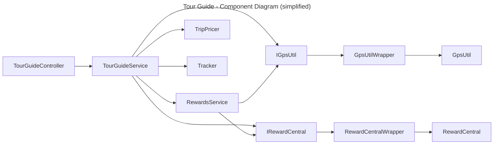
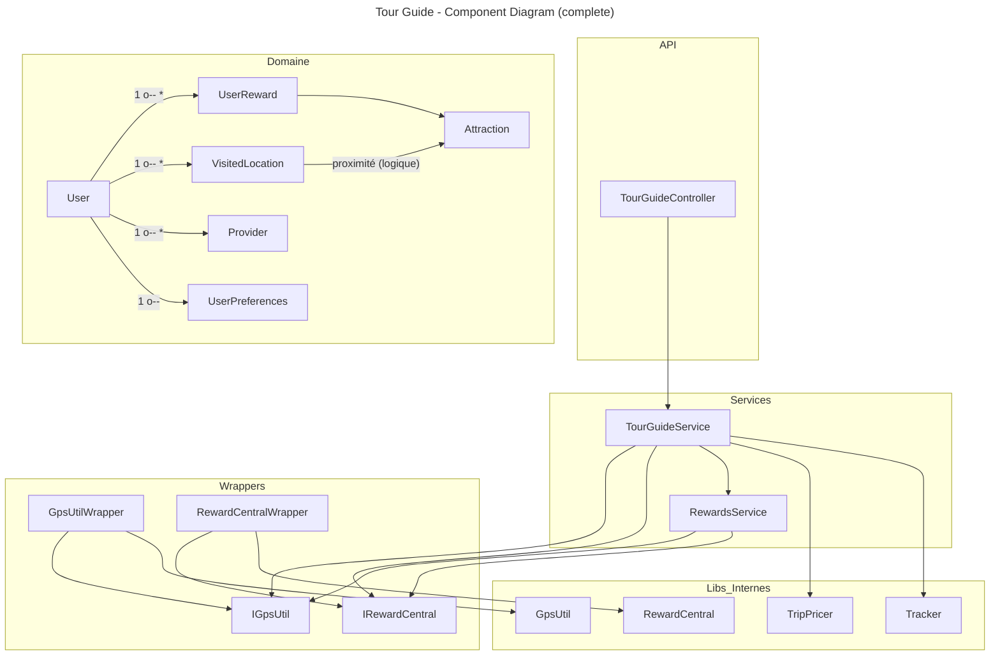

# TourGuide | Documentation fonctionnelle et technique

## Sommaire

1. [Présentation du projet](#1-pr%C3%A9sentation-du-projet)
    1. [Objectifs du projet](#11-objectifs-du-projet)
    2. [Hors du champ d'application](#12-hors-du-champ-dapplication)
    3. [Mesures du projet](#13-mesures-du-projet)
2. [Spécifications fonctionnelles](#2-sp%C3%A9cifications-fonctionnelles)
    1. [Périmètre utilisateur](#21-p%C3%A9rim%C3%A8tre-utilisateur)
    2. [Cas d'utilisation principaux](#22-cas-dutilisation-principaux)
    3. [API publique](#23-api-publique)
3. [Spécifications techniques](#3-sp%C3%A9cifications-techniques)
    1. [Schémas de conception technique](#31-sch%C3%A9mas-de-conception-technique)
    2. [Glossaire](#32-glossaire)
    3. [Solutions techniques](#33-solutions-techniques)
    4. [Autres solutions non retenues](#34-autres-solutions-non-retenues)

## 1. Présentation du projet

TourGuide est un service backend de recommandation touristique permettant :
* d’obtenir la position géolocalisée d’un utilisateur,
* de calculer et stocker l’historique de ses visites,
* d’identifier les attractions touristiques les plus proches,
* d’attribuer des points de récompense en fonction des attractions visitées,
* de proposer des offres de voyage (trip deals) contextualisées.
L’application se concentre sur l’optimisation, la parallélisation et la conception de services .NET autour de la géolocalisation et de la recommandation.

### 1.1 Objectifs du projet
| Objectif | Description |
|----------|-------------|
| Géolocalisation | Interroger un service GPS (lib interne) pour récupérer la position courante d’un utilisateur. |
| Récompenses | Calculer et stocker des points de fidélité lors de la proximité d’une attraction. |
| Recommandation | Remonter les 5 attractions les plus proches et les offres de voyages adaptées. |
| Extensibilité | Fournir une architecture modulable (wrappers, services) facilitant des remplacements futurs (GPS, rewards, pricing). |

### 1.2 Hors du champ d'application
| Élément hors périmètre | Justification |
|------------------------|--------------|
| Authentification / gestion d’identités | Simplifié : les utilisateurs internes sont générés en mémoire. |
| Persistance en base de données | Actuellement stockage uniquement en mémoire (dictionnaire). |
| Frontend / UI | Le livrable est une API REST seule. |
| Algorithmes avancés (ML, clustering) | Non requis pour l’objectif pédagogique. |
| Gestion fine des fuseaux horaires | Utilisation UTC simple dans l’état actuel. |

### 1.3 Mesures du projet
| KPI | Mode de mesure | Cible indicative |
|-----|---------------|------------------|
| Latence endpoint `getLocation` | Temps moyen (ms) | < 200 ms (hors cold start) |
| Calcul de récompenses | Nombre d’utilisateurs traités / cycle | 1000+ utilisateurs internes en mode test |
| Précision attractions proches | Top 5 triés par distance | Conformité logique |
| Robustesse | Absence d’exceptions non gérées en production | 0 erreurs critiques |

---

## 2. Spécifications fonctionnelles

### 2.1 Périmètre utilisateur
Acteurs :
* Utilisateur final (représenté via un objet User simulé pour l’instant)
* Système interne (Tracker) qui met à jour périodiquement les positions et calcule les récompenses.

### 2.2 Cas d'utilisation principaux
| ID | Cas d’usage | Description | Préconditions | Postconditions |
|----|------------|-------------|---------------|----------------|
| UC1 | Consulter position | Obtenir la dernière position connue ou générer une nouvelle localisation via GPS | User existe | VisitedLocation ajoutée si nouvelle |
| UC2 | Lister attractions proches | Récupérer 5 attractions les plus proches de la position courante | Position disponible | Liste triée par distance croissante |
| UC3 | Consulter récompenses | Afficher les récompenses associées à un utilisateur | User existe | Liste UserReward |
| UC4 | Obtenir offres voyages | Générer des offres (providers) basées sur préférences + points | User existe + préférences par défaut | Liste d’offres enrichit User.TripDeals |
| UC5 | Mise à jour périodique | Tracker met à jour chaque utilisateur interne | Tracker actif | Historique positions enrichi + recalcul récompenses |

### 2.3 API publique
Base route : `/TourGuide`.

| Méthode | Route | Paramètres query | Description | Retour |
|---------|-------|------------------|------------|--------|
| GET | `/TourGuide/getLocation` | `userName` | Position du user (dernière ou nouvelle) | `VisitedLocation` |
| GET | `/TourGuide/getNearbyAttractions` | `userName` | 5 attractions les plus proches (TODO futur : objet enrichi) | `List<Attraction>` actuelle |
| GET | `/TourGuide/getRewards` | `userName` | Récompenses calculées | `List<UserReward>` |
| GET | `/TourGuide/getTripDeals` | `userName` | Offres de voyages TripPricer | `List<Provider>` |

Remarque : un TODO dans le contrôleur demande d’enrichir la réponse de `getNearbyAttractions` pour exposer distance, coordonnées et points potentiels.

---

## 3. Spécifications techniques

### 3.1 Schémas de conception technique

### 3.2 Glossaire
| Terme | Définition |
|-------|-----------|
| User | Représente un utilisateur consommateur du service TourGuide. |
| VisitedLocation | Association User + position GPS + timestamp. |
| Attraction | Point d’intérêt touristique avec nom, ville, état, coordonnées. |
| UserReward | Récompense octroyée pour proximité d’une attraction. |
| Reward Points | Valeur entière fournie par RewardCentral. |
| Trip Deal / Provider | Offre de voyage calculée via TripPricer. |
| Tracker | Tâche périodique de mise à jour des positions utilisateurs. |

### 3.3 Solutions techniques
Les choix techniques sont volontairement simples et pragmatiques pour répondre aux besoins de l'exercice.

- Résumé des choix principaux
    - Framework : ASP.NET Core + C# (.NET). API REST avec contrôleurs minces et services métiers.
    - Découpage : Controller -> Service (orchestration) -> RewardsService (règles) -> Wrappers (IGpsUtil, IRewardCentral) -> libs internes.
    - DI : services enregistrés en scoped dans `Program.cs` pour testabilité et inversion de dépendances.
    - Calcul de distance : méthode trigonométrique dans `RewardsService.GetDistance` (précise, coût CPU non nul).
    - Concurrence légère : `lock` pour l'ajout de récompenses et `HashSet` pour éviter doublons lors du calcul.
    - Tracker : tâche de fond simple (Task + CancellationToken) qui met à jour les utilisateurs toutes les 5 minutes.
    - Tests : projet `TourGuideTest` présent ; mode test crée des utilisateurs internes pour scénarios.

- Intégration continue: GitHub Actions,
    solution de CI la plus simple pour un projet hébergé sur GitHub.

### 3.4 Autres solutions non retenues
Courtes alternatives envisagées mais jugées disproportionnées pour l'exercice :

- Base de données relationnelle (EF Core) : utile pour persistance, mais ajoute de la configuration et du temps d'exploitation inutile pour un POC en mémoire.
- Cache distribué (Redis) : intéressant pour multi‑instance, mais overkill localement.
- Microservices / messaging : complexité d'orchestration et déploiement supérieure aux bénéfices pour ce projet.
- Index géospatial dédié (PostGIS, R‑Tree) : pertinent à grande échelle, inutile pour un jeu d'attractions limité.
- Caching précalculé des distances : optimisation possible mais complexifie l'invalidation pour peu de bénéfice immédiat.

Ces solutions peuvent être réévaluées si le projet évolue vers une utilisation en production à grande échelle.
